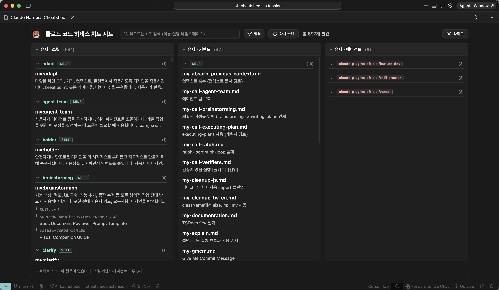
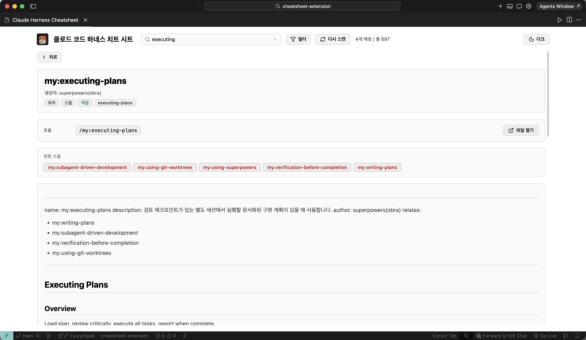
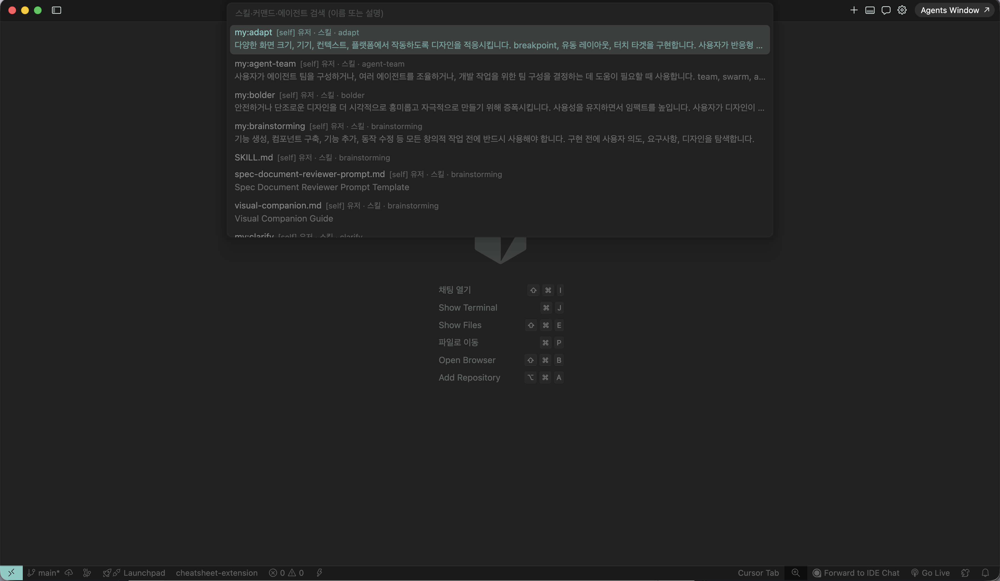

# Claude Code Harness Cheatsheet

### 스킬·커맨드·에이전트를 에디터 안에서 한눈에

`~/.claude/`와 워크스페이스 `.claude/`의 Claude Code 하네스를 치트 시트로 보세요

### 기능

- **통합 2×3 매트릭스**: 유저 스코프와 프로젝트 스코프의 스킬·커맨드·에이전트를 한 화면에
- **워크스페이스 인식**: `~/.claude/` (+ 플러그인 캐시)와 현재 워크스페이스의 `.claude/`를 함께 스캔, 개인 자산과 프로젝트 자산을 분리해서 표시
- **frontmatter 상세 패널**: 항목을 클릭하면 `SKILL.md`에서 파싱한 설명·트리거 키워드·작성자·관련 스킬을 확인
- **Quick Pick 검색**: `Cmd + Shift + Alt + H`로 전 스코프에서 fuzzy 검색
- **라이트/다크 테마**: 패널 헤더에서 토글, 세션 간 유지

### 시작하기

VS Code 마켓플레이스에서 설치

- 치트시트 열기/닫기 -> **`Cmd + Shift + H`** (mac) / **`Ctrl + Shift + H`** (win/linux)
- Quick Pick 검색 열기 -> **`Cmd + Shift + Alt + H`**
